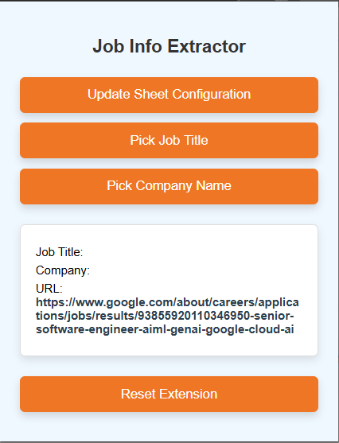
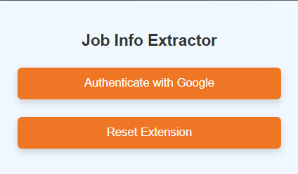
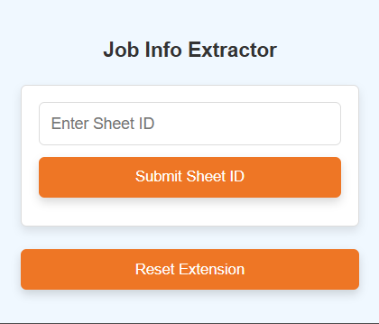
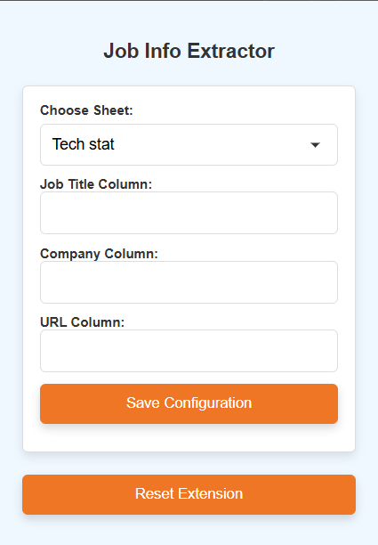

# Job Info Extractor

## Table of Contents
- [Overview](#overview)
- [Features](#features)
- [Technologies Used](#technologies-used)
- [Installation](#installation)
- [Configuration](#configuration)
- [Usage](#usage)
- [Screenshots](#screenshots)
- [Contributing](#contributing)
- [License](#license)

## Overview

**Job Info Extractor** is a Chrome extension designed to streamline the process of extracting job-related information from websites and storing it directly into a Google Spreadsheet. Whether you're a recruiter, job seeker, or HR professional, this tool simplifies data collection, ensuring your job listings are organized and easily accessible.

## Features

- **Real-time Data Extraction**: Seamlessly extract job titles, company names, and URLs from any webpage.
- **Google Sheets Integration**: Automatically store extracted data into your preferred Google Spreadsheet.
- **OAuth2 Authentication**: Secure authentication flow with Google to protect your data.
- **Configurable Sheet Settings**: Customize which sheet and columns to use for storing data.
- **User-Friendly Interface**: Intuitive popup interface for easy interaction and data management.
- **Error Handling**: Comprehensive error messages and notifications to guide users through any issues.

## Technologies Used

- **JavaScript**: Core language for extension functionality.
- **Chrome Extensions APIs**: Background scripts, content scripts, storage, and more.
- **OAuth2**: Secure authentication with Google.
- **Google Sheets API**: Interaction with Google Spreadsheets to store data.
- **HTML & CSS**: For the popup interface and user interactions.

## Installation

1. **Clone the Repository**
   ```bash
   git clone https://github.com/yourusername/job-info-extractor.git
   ```

2. **Navigate to the Project Directory**
   ```bash
   cd job-info-extractor
   ```

3. **Set Up OAuth2 Credentials**
   - Go to the [Google Cloud Console](https://console.cloud.google.com/).
   - Create a new project or select an existing one.
   - Navigate to **APIs & Services > Credentials**.
   - Click on **Create Credentials > OAuth client ID**.
   - Choose **Chrome App** as the application type.
   - Set the **Authorization URI** to `https://{your_extension_id}.chromiumapp.org/`.
   - Replace the `client_id` in `manifest.json` with your generated client ID.

4. **Load the Extension in Chrome**
   - Open Chrome and navigate to `chrome://extensions/`.
   - Enable **Developer mode** using the toggle in the top right corner.
   - Click on **Load unpacked** and select the `job-info-extractor` directory.

## Configuration

1. **Authenticate with Google**
   - Click on the **Job Info Extractor** icon in the Chrome toolbar.
   - Click the **Authenticate with Google** button.
   - Follow the prompts to allow the extension access to your Google Sheets.

2. **Set Up Google Spreadsheet**
   - Create a new Google Spreadsheet or use an existing one.
   - Note down the **Sheet ID** from the URL. For example, in `https://docs.google.com/spreadsheets/d/1AbCdEfGhIjKlMnOpQrStUvWxYz1234567890/edit#gid=0`, the Sheet ID is `1AbCdEfGhIjKlMnOpQrStUvWxYz1234567890`.
   - Enter this Sheet ID in the extension popup by clicking on **Add Sheet ID**.

3. **Configure Sheet Columns**
   - After entering the Sheet ID, the extension will fetch available sheet names.
   - Select the desired sheet and specify which columns correspond to **Job Title**, **Company**, and **URL**.
   - Save the configuration.

## Usage

1. **Extracting Job Information**
   - Navigate to a webpage containing job listings.
   - Click on the **Job Info Extractor** icon in the Chrome toolbar.
   - Use the **Pick Job Title** and **Pick Company Name** buttons to select relevant information.
   - After making selections, click **Confirm Selection**.

2. **Storing Data in Google Sheets**
   - Once data is confirmed, the **Move to Sheet** button becomes active.
   - Click on **Move to Sheet** to store the extracted information in your configured Google Spreadsheet.

3. **Resetting the Extension**
   - If you need to clear all data and reset the extension, click on the **Reset Extension** button in the popup.
   - Confirm the action to remove all stored data and authentication tokens.

## Screenshots



*Main interface of the Job Info Extractor extension.*



*OAuth2 authentication prompt.*



*Sheet ID configuration interface.*



*Column configuration interface.*

## Contributing

Contributions are welcome! Please follow these steps:

1. **Fork the Repository**
2. **Create a Feature Branch**
   ```bash
   git checkout -b feature/YourFeature
   ```
3. **Commit Your Changes**
   ```bash
   git commit -m "Add some feature"
   ```
4. **Push to the Branch**
   ```bash
   git push origin feature/YourFeature
   ```
5. **Open a Pull Request**

Please ensure your code adheres to the project's coding standards and includes relevant tests.

## License

This project is licensed under the [MIT License](LICENSE).

## Contact Information

For support or questions, please contact me at https://www.linkedin.com/in/senthamarai-kannan-dhanavel.

---

Thank you for your interest in the Job Info Extractor!


